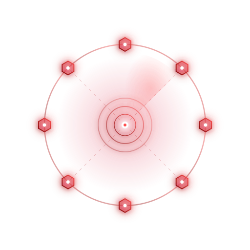

<p align="center">
  
  <h1 align="center">cyber-harness</h1>
  <p align="center">用于 cyber 场景的通用 agent harness，一切皆扩展</p>
</p>

<p align="center">
  <a href="https://github.com/chainreactors/cyber-harness/releases"></a>
  <a href="https://github.com/chainreactors/cyber-harness/actions/workflows/ci.yml"></a>
  <a href="https://github.com/chainreactors/cyber-harness/releases"></a>
  <a href="https://github.com/chainreactors/cyber-harness/blob/master/LICENSE"></a>
  <a href="https://github.com/chainreactors/cyber-harness/stargazers"></a>
</p>

<p align="center">
  <a href="README.md">English</a>
</p>

---

cyber-harness 是用于 cyber 场景的通用 Agent 运行框架。它把模型循环、工具执行、知识、观测和协作按同一套 Extension 生命周期组装，由任务和已安装的扩展决定使用哪些工具与工作流；你可以使用现成发行版，也可以在 Go 应用里选择自己的能力组合。

按任务选择入口：

| 入口 | 用途 |
| --- | --- |
| `aiscan` / `aiscan-full` | Agent、核心扫描器、代理和 IOA；full 增加 Web、浏览器、被动测绘和爬取 |
| [`cyber-audit`](cmd/audit/README.md) | 模型驱动的源码与二进制审计、证据收集和报告 |
| `cyber-web`（源码构建） | 通用 Web Hub，管理 scan、audit 或自定义 AOP 节点的会话、事件与产物 |
| `agent` | 从源码构建的最小本地 Agent，包含文件、终端、Skills 和本地子 Agent |

> 请只在明确授权的目标上使用。

## 开始使用

从 [GitHub Releases](https://github.com/chainreactors/cyber-harness/releases/latest) 下载与你的系统和架构匹配的压缩包。使用 CLI 时选择 `aiscan` 或 `cyber-audit`，解压后将可执行文件加入 PATH。执行 Agent 任务前，先按下文完成模型配置：

```sh
# 已配置模型后：完成一次 Agent 任务，保存事件记录
aiscan agent -p "只读查看当前目录并解释文件结构" -o first-run.jsonl

# 审计本地代码仓库
cyber-audit --workdir /path/to/repository -p "审计认证逻辑与租户隔离"

# 对自己的本地靶场执行规则扫描，关闭 AI 验证
aiscan scan -i http://127.0.0.1:3000 --verify=off
```

使用 Web 工作台时，下载 `aiscan-full` 并启动：

```sh
aiscan-full web --token replace-me
```

访问 `http://127.0.0.1:8080`，使用 access key 登录。快速连接面板会生成一行命令，在执行节点所在机器上下载并启动扫描或审计节点。已有节点程序时，在另一个终端选择对应命令接入：

```sh
aiscan agent --server-url http://replace-me@127.0.0.1:8080
cyber-audit --workdir /path/to/repository --server-url http://replace-me@127.0.0.1:8080
```

安装、PowerShell 配置、模型连接和首个任务的完整步骤见[快速上手](docs/getting-started.md)。Agent 由模型决定下一步工具调用；`scan` 由规则和扫描事件驱动，可按需启用 AI 阶段。

## 模型配置

运行 `cyber-web init` 或 `aiscan init` 配置用户级模型（`~/.cyber/cyber.yaml`）；项目覆盖增加 `--project`。这些是 cyber-harness 公共命令，通用 `agent` CLI 同样支持；重复初始化保留已有文件。详见[配置与初始化](docs/configuration.md)。

`cyber.yaml` 示例：

```yaml
llm:
  provider: openai
  base_url: https://api.deepseek.com/v1
  model: deepseek-chat
```

通过 `CYBER_API_KEY` 提供密钥，端点与模型使用你的账号实际可用的值。Anthropic-compatible 服务使用 `provider: anthropic` 和相应配置。协议、profile、环境变量优先级见[配置参考](docs/reference.md)。

## 文档

从[文档首页](docs/README.md)进入。教程与参考描述当前已实现的行为，正文以中文为主；使用 release 时选择对应 Git tag 的文档。

| 需要做什么 | 阅读入口 |
| --- | --- |
| 理解 harness、模型、工具与会话 | [基本概念](docs/concepts.md) |
| 安装、配置模型并完成第一次任务 | [快速上手](docs/getting-started.md) · [模型配置](docs/configuration.md) |
| 使用会话、工具、Skills、扫描与协作 | [使用者指南](docs/README.md#使用者指南) · [审计指南](cmd/audit/README.md) |
| 构建 Go 应用或嵌入会话 | [开发者指南](docs/development.md) |
| 接入外部客户端或查询参数 | [第三方语言集成](docs/integration.md) · [API](docs/api.md) · [配置与命令](docs/reference.md) |
| 理解生命周期、执行与数据归属 | [架构](docs/architecture.md) |
| 升级前了解版本变化 | [Changelog](docs/changelog.md) |

## 构建与嵌入

### 准备源码

安装 Git 和 [go.mod](go.mod) 指定的 Go 版本（当前为 Go 1.26）。Makefile 需要 GNU Make 和 POSIX shell；Windows 可安装 MSYS2 工具链并加入 PATH，或使用下文的 PowerShell 直接构建命令。

```sh
git clone --recurse-submodules https://github.com/chainreactors/cyber-harness.git
cd cyber-harness
# 已有仓库补齐子模块
git submodule update --init --recursive
```

### 构建源码发行版

以下命令均在仓库根目录执行，产物默认放在 `bin/`；Windows 下自动追加 `.exe` 后缀。

| 命令 | 产物 | 能力 | 是否需要前端 |
| --- | --- | --- | --- |
| `make` / `make standard` | `bin/aiscan` | Agent、核心扫描器、代理、Skills 和 IOA | 否 |
| `make full` / `make web-build` | `bin/aiscan-full` | 标准能力，加 Web、浏览器、被动测绘和爬取 | 是 |
| `make audit` | `bin/cyber-audit` | 源码与二进制审计，从独立的 `cmd/audit` 模块构建 | 否 |
| `make agent` | `bin/agent` | 本地 Agent、文件、终端、Skills 和本地子 Agent | 否 |
| `make all` | `bin/aiscan` 与 `bin/aiscan-full` | 标准与完整发行版 | 是 |

需要前端的目标还需 Node.js/npm（CI 使用 Node.js 22）。首次构建前安装前端依赖：

```sh
npm --prefix web/frontend ci
make
make full
```

上述目标均使用 `CGO_ENABLED=0`。`make web-build` 构建完整发行版，`make web` 还会启动其 Web 服务。构建标签统一维护在 [editions.env](editions.env)，执行步骤见 [Makefile](Makefile)。独立的 `cyber-web` Hub 可从源码构建：先执行 `make frontend`，再运行 `CGO_ENABLED=0 go build -tags "full sqlite" -o bin/cyber-web ./cmd/cyber-web`。原生录屏使用 `make record`，需要 CGO 与录屏 SDK，详见[录屏构建](docs/record.md)。

### 构建最小本地 Agent

`make agent` 只需 Go 和 Makefile 工具链，依赖图中不包含扫描器、代理、IOA、浏览器、录屏和 Web。[配置模型](docs/configuration.md)后直接通过 `-p` 运行任务：

```sh
make agent
./bin/agent -p "只读查看当前目录并解释文件结构"
```

不使用 Make 时，可在仓库根目录通过 PowerShell 构建：

```powershell
$env:CGO_ENABLED = "0"
go build -trimpath -buildvcs=false -ldflags "-s -w" -o bin/agent.exe ./cmd/agent
.\bin\agent.exe -p "只读查看当前目录并解释文件结构"
```

### 自定义最小应用

最小工具宿主，无需模型。保存为 `cmd/my-agent/main.go`：

```go
package main

import (
    "context"
    "fmt"
    "os"

    "github.com/chainreactors/cyber/agent/provider"
    "github.com/chainreactors/cyber/core/tool"
    "github.com/chainreactors/cyber/pkg/harness"
)

func main() {
    dir, err := os.Getwd()
    check(err)
    ctx := context.Background()
    app, err := harness.New(harness.Config{Base: harness.BaseConfig{
        Directory: dir,
        Provider: provider.StartupConfig{Mode: provider.StartupDisabled},
    }})
    check(err)
    defer func() { check(app.Close(ctx)) }()
    check(app.Load(ctx))

    bash, err := app.Bash()
    check(err)
    result, err := bash.Execute(ctx, `{"command":"echo Hello, Cyber!"}`)
    check(err)
    fmt.Println(tool.ResultText(result))
}

func check(err error) {
    if err != nil {
        panic(err)
    }
}
```

在仓库根目录编译并运行：

```sh
CGO_ENABLED=0 go build -o bin/my-agent ./cmd/my-agent
./bin/my-agent
# Hello, Cyber!
```

PowerShell:

```powershell
$env:CGO_ENABLED = "0"
go build -o bin/my-agent.exe ./cmd/my-agent
.\bin\my-agent.exe
```

扩展用法：[注册工具](docs/developer/extensions.md) · [接入模型与会话](docs/developer/hosting.md#嵌入一个会话) · [保留 CLI](cmd/agent)。

### 高级构建

[资源内嵌开关](Makefile) · [外部工具与离线分发](docs/arsenal-bundles.md) · [原生录屏](docs/record.md)。

## 贡献

先阅读[开发者指南](docs/development.md)与[文档维护标准](docs/maintaining-docs.md)。测试运行说明分别见[仓库 harness](cmd/harness/README.md)、[Web 前端](web/frontend/e2e/README.md)与[审计测试](cmd/audit/tests/README.md)。提交 PR 时描述具体行为变化、影响的入口和验证结果；行为变化应同步更新对应教程或参考页。

## 免责声明

1. 本框架用于 cyber 场景下**合法授权**的 Agent 任务、研究与个人学习。扫描示例请在自建或有权测试的环境中运行。
2. 在使用本工具进行检测时，您应确保该行为符合当地的法律法规，并且已经取得了足够的授权。**请勿对非授权目标进行扫描。**
3. 如您在使用本工具的过程中存在任何非法行为，您需自行承担相应后果，我们将不承担任何法律及连带责任。
4. 在安装并使用本工具前，请您**务必审慎阅读、充分理解各条款内容**，限制、免责条款或者其他涉及您重大权益的条款可能会以加粗、加下划线等形式提示您重点注意。
5. 除非您已充分阅读、完全理解并接受本协议所有条款，否则，请您不要安装并使用本工具。您的使用行为或者您以其他任何明示或者默示方式表示接受本协议的，即视为您已阅读并同意本协议的约束。

## 许可证

本项目使用 [GNU Affero General Public License v3.0 (AGPL-3.0)](LICENSE) 许可。

## 链接

- [chainreactors](https://github.com/chainreactors) — 组织
- [IOA](https://github.com/chainreactors/ioa) — Internet of Agents 多 agent 协作协议
- [sdk](https://github.com/chainreactors/sdk) — 扫描器 SDK
- [proxyclient](https://github.com/chainreactors/proxyclient) — 多协议代理客户端
- [crtm](https://github.com/chainreactors/crtm) — CLI 工具包注册中心
- [utils](https://github.com/chainreactors/utils) — 共享工具库 & PTY 管理器
- [parsers](https://github.com/chainreactors/parsers) — 协议和数据解析器

---

<p align="center">
  <a href="https://star-history.com/#chainreactors/cyber-harness&Date">
    
  </a>
</p>
