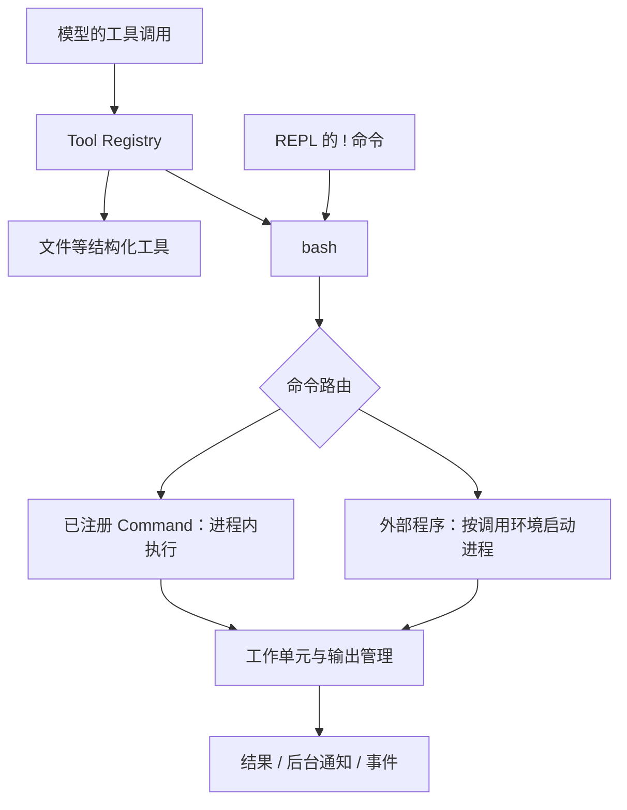

# 工具与执行环境

[架构概览](../architecture.md) · 前一篇：[Agent 运行时](runtime.md) · 下一篇：[上下文与知识](context.md)

模型请求一个工具之后，harness 必须把请求转成实际工作，并负责输出、超时和清理。本章沿这条路径解释 Tool、Command、进程和网络。

## 工具与命令的执行链

Tool Registry 暴露模型能看到的结构化工具定义；Command Registry 暴露命令行能力。`bash` 是 Tool，而 `gogo`、`spray`、`scan`、`proxy` 等可以是 Command。

`core/tool` 分别定义 Tool/Executor 与 Command/CommandExecutor，两个注册表有独立的贡献点和执行契约，共用 `core/registry` 的撤销与排空机制。扩展在 Load 中贡献条目；撤销先停止新调用并等待在途执行，之后才释放工具背后的资源。协议入口通过 `ExecuteToolRequest` 关联进度并限制内联输出。



`BashTool` 解析 Bash 文本，由 `mvdan.cc/sh/v3/interp` 处理变量展开、shell builtin、重定向、管道和条件执行。每个命令节点将展开后的 argv 交给 `core/tool.RunCommand`：已注册的 Command 优先于 PATH 中的同名程序，注册表负责准入、hooks 和错误；其余命令按调用的 PATH、目录、环境和标准流启动 OS 进程。shell builtin 遵循解释器自己的优先级。

因此，管道和多层脚本也能调用进程内 Command，无需安装同名可执行文件。单独启动的 shell 或 REPL 则使用该进程自己的 PATH，不能调用进程内注册表。外部程序仍依赖宿主安装和权限；`bash` 的名字并不提供一个容器或文件系统沙箱。

这种设计让模型沿用命令行知识，CLI 和 Agent 又可以调用同一个业务实现。新增扫描器通常先增加 Command，需要专门结构化交互时再增加 Tool。

## 文件访问

`exts/files` 持有 `tools/files.Resource`，在 Load 中打开配置的绝对根目录，并贡献文件工具。消费者借用 `*files.Files` 的业务方法，关闭由资源所有者负责；撤销工具并排空调用之后，停止文件准入、取消操作并关闭 root。

本地路径限制在 root 内，系统分隔符规范为 `/`；读写接受普通文件并受单次 `MaxBytes` 限制，默认 1 MiB。只读配置不贡献写工具。写入使用同目录临时文件和 rename，失败保留原文件并清理临时文件；不隐式创建父目录，也不承诺 fsync 或跨平台 rename 原子性。这些限制只作用于文件工具，外部命令仍按宿主权限访问环境。

`Config.Mounts` 将只读 `fs.FS` 挂到 URI 前缀，按最长前缀匹配，虚拟读取同样检查路径、类型和大小；内嵌 Skill 因此可通过 `cyber://skills/` 读取。实际 IO 完成后同步发送 `FileEvent` hook，所选 observe 扩展再生成 AOP 文件访问事实。实现与测试见[文件能力](../../tools/files)。

## 工具准入

所有 Tool Registry 调用都经过 `core/tool/hooks.Execute`。核心管理 hooks、准入与取消；`exts/guardrail` 通过一个 `tool.before` 处理器提供策略判断和待审批状态，直接调用 JEV provider 的原生 `choice`，不依赖 Reflex 执行循环。未配置策略时不做检查。

每次调用独立检查原始参数。`record` 继续执行；被标记为 `review` 或 `block` 时，`auto` 模式再次判断实际后果，只有明确无害才放行，`safe` 模式等待人工处理。拒绝、过期或取消返回工具错误，Agent 可以继续选择其他操作。审批唤醒原调用并只执行一次，不能覆盖其他 hook 的拒绝，也不会重新提交工具调用。

扩展关闭会取消判断和待审批调用，再撤销处理器并排空工作。Decision 和 Review 通过 `cyber.guardrail` protobuf 命名空间进入 AOP 事件流；历史记录用于展示，不在重启时恢复可执行审批。配置和处理步骤见[工具指南](../user/tools.md#工具准入与审批)。这一边界覆盖工具调用，已经启动的子进程内部行为和原始 PTY 输入仍由执行环境控制。

## 等待与超时

以下是 Agent 向 `bash` 传递的 JSON 参数，不是启动 `aiscan` 的参数：

```json
{"command":"某个需要较长时间的命令","wait":5,"timeout":120}
```

| 参数 | 语义 |
| --- | --- |
| `wait: 0` 或省略 | 等待命令结束 |
| `wait: 5` | 最多在本次工具调用里等待 5 秒；未完成则返回后台 session ID |
| 省略 `timeout` | 使用工具默认总运行时间，当前为 600 秒 |
| `timeout: 0` | 显式不设置命令总期限 |
| `timeout: 120` | 总运行时间 120 秒，转入后台后仍然有效 |

后台命令定期把增量输出送入 Inbox，完成后投递完成消息。`tmux` 是这一工作单元管理的命令表面，可查询、读取、送键和停止任务；这里不要求系统安装同名 tmux 程序。模型可读的输出有截断限制，长输出应分段读取或保存为文件。

AOP 的前台工具执行等入口使用前台执行契约，不能把上面的 Agent 后台等待行为直接套到所有远程调用。Runner 也可以设置额外的前台超时上限。

## 工作单元与清理

工作注册表统一跟踪四种 attachment：`tty`（PTY 进程）、`pipe`（分离标准流的进程）、`func`（进程内函数）、`extern`（外部子系统持有的工作）。它们共享身份、状态、输出与停止接口，只有 OS 进程才有真实 PID 和 `Proc.ExitCode`；解释器通过 `proc.Info.Status` 保存逻辑退出码，其 `Proc` 可以为空。

例如扫描器以进程内函数执行，即使没有非零退出码，也可能处于失败状态。调用端必须检查终态和原因，不能只看 exit code。PTY 适合交互终端，pipe 适合不能混入终端控制字符的协议字节流。

`tmux new-session` 的单个字面外部程序使用真实 PTY；脚本或已注册命令使用受管理的解释器会话。分离任务把取消范围转交进程 Manager，由 Manager 持有到任务结束。

停止进程按 interrupt → terminate → kill 逐级推进。生命周期关闭还要排空执行、停止监视并回收子进程；取消工具调用不等于仅从界面移除一张卡片。

## 代理与 MITM

参考发行版安装 proxy 扩展，向其他扩展提供 `egress.Endpoint`。该扩展持有本地 Hub：工具使用稳定的本地代理地址，上游由 `proxy` 命令选择；`mitm` 命令查询捕获结果。最小本地 Agent 使用 `base.NoEgress()` 提供禁用路由的实现。

内置客户端接收出口配置；外部命令通过代理及 CA 环境变量接入。外部程序若忽略这些变量、自建连接或使用不受支持的协议，不能据此保证其流量被捕获。切换上游也不意味着已建立的 TCP 连接迁移。

`proxy switch`、`auto` 和 `clear` 改变后续默认连接的出口；`proxy <url> <command>` 只为本次调用及子执行建立带 token 的路由租约。Hub 按请求中的 token 选择上游，过期 token 不会退回默认出口。被包装的后台 `tmux` 会话持有租约直到结束。`proxy` 与 `mitm` 共用 `RunCommand`，保留相同的命令路由与执行语义。

默认捕获可用 `--mitm=false` 关闭，保留路由但停止 HTTPS 解密/抓包；HTTPS 捕获依赖客户端信任 Hub CA。LLM 请求的 `--llm-proxy` 是独立配置，不能和工具的 `--proxy` 混为一谈。具体命令见 [代理参考](../reference.md#代理proxy)。

## 执行能力的组合

浏览器、扫描器、录屏和外部工具安装各自拥有运行资源，通过扩展贡献工具或命令。它们共享执行和观察路径，但不会因为注册到同一个框架就获得相同的运行环境。发行版和平台决定实际可用能力，使用层面的选择见[工具与环境](../user/tools.md)。

实现：[bash 路由与后台通知](../../tools/terminal/bash.go)、[终端扩展](../../exts/terminal/extension.go)、[命令注册表](../../core/tool)、[代理扩展](../../exts/proxy/extension.go)。验证入口：[命令执行测试](../../tools/terminal/bash_test.go)、[工作单元测试](../../tools/terminal/process_test.go)。
