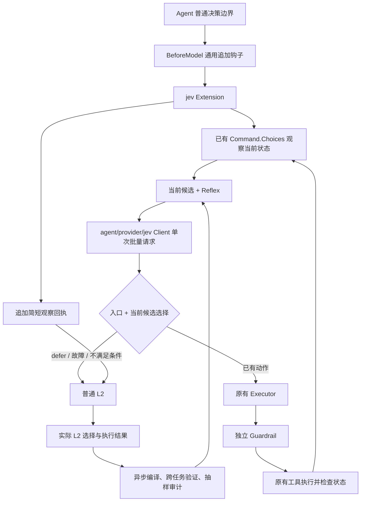

# JEV 可插拔加速扩展：实现架构与验收

本文固定 [研究稿](jev-harness-design-20260926.md) 在当前 aiscan harness 中的实现边界。名称保持 `jev`；配置使用 `mode: off | learn | auto`，不引入名为 optimization 的独立对象或子系统。

## L1 的优化单位

L1 替代的是 L2 的能力选择和实时操作决策。浏览器场景包括“当前任务是否需要进入 Playwright”以及“根据当前页面，接下来使用哪个已有操作”。Playwright 仍执行操作；JEV 替代为这些操作反复 thinking 的模型调用。

Reflex 保存可泛化的能力入口和决策准则，例如按用户目标选择当前可见控件、缺少输入值时交回 L2。它不保存访问路径、selector、任务 URL、步骤编号或动作序列。页面 ID、控件顺序、按钮变成链接、任务目标改变，都由每次实时观察重新建立候选。学习历史用于提炼准则和验证是否值得启用；历史动作不直接成为可执行模板。

固定路径向导仅保留为机制回归。浏览器能力测试另覆盖从无会话进入浏览器，并用同一条 Reflex 在未见过的页面结构和任务目标上实时选择。真实验收需要同时证明这种覆盖、正确性和整体收益，不能只证明某一条向导路径少调用了 L2。

## 架构



Agent 内核没有 JEV、Reflex、浏览器或扫描器依赖。未安装扩展时走零处理器路径；`mode: off` 不借用客户端、不注册钩子或命令。扩展故障返回普通 L2，不能成为正常 Agent 工作的前置条件。初始化时显式配置错误仍报错，避免“用户以为启用了，实际没启用”。

JEV provider 只提供原生 `choice / score / noul` API；Reflex 是 `pkg/exts/jev` 的扩展抽象。Guardrail 是另一个独立扩展，直接使用 `choice` 实现 `tool.before`，不依赖 Reflex。

JEV provider 位于 `agent/provider/jev`，使用厂商原生有限选择请求；普通 LLM 继续使用既有 ChatCompletion。两者都属于 Agent 的模型接入能力，不再保留 `pkg/jev` 中转包。Reflex、学习、验证、接管循环只存在于 `pkg/exts/jev`，Agent 执行循环不导入它。

| 位置 | 唯一职责 | 不承担的职责 |
| --- | --- | --- |
| `agent/hooks.BeforeModel` | 每次模型决策前接受追加的观察消息；重试不重复运行 | 不认识 JEV，不修改历史，不接收伪造 assistant/tool 消息 |
| `core/tool.Command.Choices`、`Contract` | 在原有注册生命周期内提供观察与有限的原生候选 | 不执行动作，不建立第二个注册表 |
| `agent/provider/jev.Client` | TypeSafe 原生 HTTP 协议、有限重试、用量统计 | 不做风险策略、学习或工具执行 |
| `pkg/exts/jev.Extension` | Reflex 的学习、验证、选择、执行循环、持久化和日志 | 不定义执行器、DSL、脚本运行时或工具代理层 |
| `pkg/exts/guardrail` | 独立的准入、风险判断与复核，可独立使用同一 JEV 客户端 | 不因加速命中而放宽权限 |
| `tools/playwright` / `tools/curl` | 候选空间和实际状态的所有权 | 不依赖 JEV 扩展或替 JEV 决定策略 |
| `cmd/aiscan/profile.go` | 组合已有扩展，提供一个共享客户端，迁移旧配置 | 不转发每次推理或每次工具请求 |

核心对象只有 `Reflex`：**入口条件 + 决策说明 + 已有能力绑定**。其 source/contract 指向工具声明的能力；enter 决定当前空间是否足够，decide 从本轮重新观察的候选中选择。一个能力可以有多条 Reflex。它不是固定动作序列，也不是生成并执行的程序。

`Reflex.Labels` 可描述有限结论；工具候选直接复用 `aop.Content` 的 ToolCall/Text。私有 sample/check 仅是学习过程的内部记录，不形成新增传输协议。核心 `Executor` 接口保持原样。

## 逐项抽象与 API 审查（2026-09-28）

| 对象 / API | 必要性及收敛后的约定 |
| --- | --- |
| `Reflex` | 唯一领域对象。Source/Contract 绑定已有能力；Enter/Decide 描述判断；Labels 仅用于有限结论。ID 是内容与环境的指纹，不是新的身份服务。 |
| Reflex 的 Environment/Phase/TrainingTasks/Checks/Uses | 都是同一规则的本地验证状态：隔离环境、禁止训练泄漏、记录激活证据和抽样进度。没有再拆成 Registry/Manager/PolicyEngine。 |
| `sample` | 一次实际决策的本地记录。保留原生消息前缀、现有候选及真实结果用于重放，不传给工具，不建立 claim DTO。 |
| `check` | 一次验证的可审计结果，记录一致性、L2 自洽性、是否必须 defer、延迟与成本；字段直接服务于激活门槛。 |
| `Command.Choices(ctx, messages)` | ctx 提供取消和会话身份；messages 用于已知值和任务范围；返回原生观察 JSON 与原生 Content 候选。没有额外 Candidate/Action/Execution DTO。 |
| `Command.Contract` | 候选语义改变时使旧验证失效。它是能力版本，不是业务选择条件。 |
| 候选 `ToolCall.Id` | 是工具发出的本次观察绑定，执行器必须原样保留。浏览器使用保留前缀识别受状态校验的调用，再以会话内记录验证参数、节点、文档与一次性消费；前缀本身不授权执行。 |
| `ChoiceCommands/Choices` | 原 CommandRegistry 的查询与有生命周期的观察。扩展对现有 CommandExecutor 做窄能力检查，不再安装一个候选注册表。 |
| `BeforeModel` | 通用追加观察边界。只返回原生消息，动作通过当前执行器完成；没有 KernelOptimization/AcceleratorRuntime。 |
| `Client.New(key, model, timeout)` | 一个真实 HTTP 客户端供两个扩展共享。超时包括重试；模型只保存在客户端，请求不再重复携带 Model 参数。HTTP 实现私有，Endpoint 仅供显式端点选择与测试。 |
| 原生 Request/Question/Response | 支持 choice、score、noul，直接对应厂商协议，不再包装应用层 wire。Confidence 仅保留为原生观测值，控制流程不用置信度阈值。 |
| `Rules / Export / Import` | 返回规则快照、导出纯规则、导入后清除验证。没有强制激活 API。 |
| `WaitLearning(ctx)` | 前台任务停止提交后等待已接纳学习批次，供 harness 结算完整开销。它不参与模型决策。Close 则取消在途任务、卸载钩子并丢弃尚未开始的批次。 |
| `canonical` | 私有的调用参数规范化。不能精确匹配的 L2 选择不形成动作训练标签；不增加 shell 程序分析器来追求训练命中率。 |

删除了无用 worker 互斥锁、Content 类型别名、公开的 canonical 辅助函数、重复的客户端请求计数入口、公开 HTTP 客户端字段、Request.Model，以及 Guardrail 内重复的 key 脱敏与 model 转发。不引入复合 shell 首动作解析器、命令完成订阅或额外样本字段来适配某个测试路径。规则快照使用字段复制；同一任务上下文与同一能力观察在批量请求里各发送一次。候选问题使用短 ID，实际执行仍保留原生调用 ID。

`tools/toolargs.TaskURLs` 只合并 curl 与 Playwright 对当前用户明确 URL 的相同提取规则，不定义范围管理服务。编译时将重复的上下文消息按内容共享、每个样本保留有序引用，完整保留约束和证据；不建立额外领域 DTO。编译的 8192 token 上限包括模型 reasoning 与规则 JSON，耗尽时失败并计费，不强制启用规则。

三个学习集合有明确寿命：pending 只保存等待下一次 L2 选择的观察；tasks 只保存当前任务已绑定的决策，任务成功后提交；training 只保存跨成功任务的有界编译材料，由单个后台 worker 独占。它们不是三个服务，也不是可扩展插件点。

固定策略常量与资源边界分开：编译门槛为 8 决策 / 2 任务 / 4 正样本；验证为 32 决策 / 3 任务 / 8 defer / 8 正向一致；每 10 次合格决策审计。运行边界为 32 动作 / 120 秒 / 16 规则 / 64 候选。它们是本版明确的验证策略和资源上限，不暴露成未经验证的配置旋钮。没有隐藏 DSL、动态代码、自动放宽阈值或失败后强制接管路径。

## 一次接管

1. 读取完整任务约束和有界近期证据，再让已有 Command 观察当前状态。
2. 从当前环境、能力契约匹配且验证通过的 Reflex 中选择。入口问题和所有推测性选择问题放入**一次** JEV 请求；同一能力的观察不重复发送。
3. 只验证并执行选中分支。未选中分支不能授权动作。选择不在本轮候选内时回退并退役规则。
4. 原生 ToolCall 经过当前 Executor 和原有 Guardrail；浏览器再验证会话所有者、文档、节点身份和状态。每个候选只能消费一次。
5. 动作完成后重新观察，再做下一次选择。最多 32 个动作、120 秒；新输入、取消、失败、停滞、未知内容或预算耗尽均交回 L2。
6. 只追加一条含结果摘要及证据日志路径的 user 观察消息。结论明确标注为待审核判断；最终回答与任务完成判断仍由 L2 负责。

JEV 不生成新工具参数、payload、策略、脚本或自由文本。遇到新的表单值、未知证据或授权不明时需要 L2。HTTP 成功、DOM 变化、工具成功均不自动等于漏洞确认。

## 上下文与 KV cache

- 模型已提交的 system、user、assistant、reasoning、tool 历史均不被 JEV 重写。
- 通用扩展说明在运行开始时加入一次，内容固定，不随学习出的规则增长。关闭与开启扩展之间可能有一次前缀差异；同一启用配置内不动态改写前缀。
- BeforeModel 收到历史副本，只能追加观察；同一个模型请求的重试不会重复接管或重复追加。
- JEV 私有观察投影保留所有文本任务约束，近期证据受大小限制，明确标记被省略的证据；约束本身超限则回退。这个投影不替换 L2 历史。
- 输入包含无法保持的图片/音频内容时回退。学习采集检查观察时的消息前缀；压缩、前缀变化或期间出现新输入时放弃旧样本，避免给旧状态贴上新任务的标签。
- 如安装了 `TransformContext` 或 `Context` 重写回调，本版不接管也不采样，因为这些回调在此边界之后才能确定实际模型输入。普通 Agent 继续运行，不增加第二条上下文变换流水线。
- 内部动作和完整工具返回写入 `.cyber/jev/execution-<task>.jsonl`，不发布无对应 assistant call 的根 tool.result，不伪造 assistant 思考。回执按正常消息 ID 与事件路径持久化。
- Agent 原有的显式压缩和上下文溢出恢复仍按其既有策略工作；JEV 不承诺服务端实际缓存命中率，验收记录真实 cache read/write 用量。

## 自动学习与规则寿命

普通任务的真实 L2 选择及成功执行结果是训练材料；不读取隐藏思考，不要求用户提示“编程 Reflex”。任务无错误地结束只代表允许收集材料，不等于业务结果已被独立证明。无法精确绑定的选择记为未知，不冒充负样本。


- 至少 8 个决策、2 个任务、4 个可绑定正样本才调用 L2 编译，每次最多 4 条自然语言规则。
- 编译输出只能描述 entry/decide 和有限结论，不允许 executable code/DSL。工具候选始终由代码维护。
- 编译任务不能进入自身验证。至少 32 个验证决策、3 个不同任务、8 个 defer 样本；保留最多 24 个正样本和 8 个负样本的窗口。
- 激活要求：没有不应接管却接管的样本；一致率不低于 L2 重放自洽率；至少 8 次正确正向选择；测得的决策延迟与费用均低于 L2 重放。费用或用量未知禁止激活。
- `learn` 执行学习和验证但不接管；`auto` 满足同样门槛后接管。每 10 个符合条件的决策抽样交回 L2；审计能包括一次内部动作之后的真实模型前缀。
- 错误绑定、错误接管或激活规则不再满足验证条件时退役。失败工具调用和过期 DOM 先让出控制，避免将正常状态变化误判为永久策略错误。
- 模型/端点、系统提示、工具定义、生成参数、JEV 版本、价格配置及能力 contract 影响复用。不同环境保存独立验证实例，不能用另一个部署的成功记录直接激活。
- 已验证规则及检查结果原子写入 `reflex-*.json`；导出只包含规则，导入清除环境、训练任务、验证与激活状态，重新验证。

当前进程内保留尚未编译的样本；进程重启后从新的普通任务重新积累这些样本。已编译规则和验证窗口会恢复。学习队列有界，饱和时放弃该批学习并记录日志，不阻塞普通任务。

## 已接入能力

**Playwright**：同一能力覆盖进入浏览器及操作实时页面。未持有会话时，将当前用户明确给出的 URL 绑定为普通 `playwright open` 候选；是否需要浏览器由 JEV 的能力入口判断。持有会话后只观察当前 Agent 拥有的页面。候选观察本身不启动浏览器。候选包括当前可见的点击、下拉选项、滚动、加载等待，以及本会话 L2 已成功填写过的值。未知文本必须交给 L2。快照使用工具提供的固定 JS，保存节点引用；不生成脚本、不修改页面属性。文档或节点替换、遮挡、禁用、跨会话、候选复用都会拒绝执行。

没有会话且没有当前任务 URL 时，观察是明确的空对象，候选为空。有 URL 时则包含进入浏览器的候选；任务已经完成时入口必须 defer，不能重开浏览器。

**aiscan / curl**：对当前用户给出的 URL 或普通 L2 已选过的 URL，提供已有 GET、GET+headers、HEAD 调用。候选中不从远端响应文本自动扩展扫描范围，不构造新 payload。工具结果、内部执行回执及独立证据进入下一轮观察。有限结论可加速证据是否足够等重复判断，但不能代替独立漏洞证据。

当前选择绑定采用原生调用参数规范化；复合 shell 程序、不同 CSS/semantic selector 不会被猜测为相同动作。复杂 iframe/shadow DOM、大于候选限制、上下文约束超限、需要新策略等情况会降低命中率并回退。它们是实时验收应量出的覆盖限制，不能用手工规则绕过。

## 配置与操作

```yaml
extensions:
  jev:
    mode: auto                     # off 为默认；learn 只学习/验证
    model: jev-1.13.0
    timeout: 10s
    # api_key: 使用 TYPESAFE_API_KEY 注入
    # directory: 默认工作区 .cyber/jev
    # prices: 按实际供应商账单填写，单位为每百万 token
    #   <L2 模型名>: {input: ..., output: ..., cache_read: ..., cache_write: ...}
    #   jev-1.13.0: {input: ..., output: ..., cache_read: ...}
  guardrail:
    provider: jev                  # 或 none，风险策略独立选择
    mode: auto
    jev:
      level: standard
      on_error: block
```

以上配置放在现有 aiscan 配置文件的 `extensions` 下。不提供猜测的价格默认值。API 未报告用量、重试费用未知或 cache_write 未定价时，不能声称费用优势。

兼容旧的 `jev.enabled/api_key/level/on_error/criteria`：当 `guardrail.provider` 未指定时迁移到原有风险策略。**只配置 API key 不启用加速**；明确 `guardrail.provider: none` 时可只使用加速。反过来 `jev.mode: off` 不会关闭独立 Guardrail。

启用扩展后，已有命令体系提供 `jev status`、`jev export <file>`、`jev import <file>`。不提供手动强制激活接口。`learning.jsonl` 记录编译、重放、选择、用量及退役；证据日志属于工作区数据，包含真实工具返回。

## 验证与测量

定向回归命令：

```powershell
go test ./agent/provider/jev ./pkg/exts/jev ./pkg/exts/guardrail ./core/tool ./agent ./agent/provider ./tools/curl -count=1
go test -tags full ./tools/playwright ./pkg/exts/browser ./pkg/exts/jev -count=1
go test -tags 'full sqlite' ./cmd/aiscan -count=1
```

测试分别覆盖：空库自动编译/验证/激活、训练与验证任务分离、动态重新观察、有限结论、选中分支绑定、Guardrail 拦截、新输入取消、无进展退出、跨环境证据隔离、导入重新验证、未知价格拒绝激活、模型重试用量、reasoning/cache 分类、追加上下文与重试前缀一致、真实 Chromium 的旧节点及一次性候选。

`TestBrowserAutomaticallyCompilesReflexFromOrdinaryTasks` 使用真实浏览器和普通 Agent/Executor，模型推理为确定性替身；从空库验证浏览器自动接管机制。它不能证明真实 JEV/L2 泛化或真实费用下降。

真实验收入口为 `TestLiveAutomaticReflexABC`，显式设置 `JEV_BENCH_LIVE=1` 后运行，使用实际 L2 和 JEV：

```powershell
# 先配置 CYBER_API_KEY、CYBER_MODEL、CYBER_BASE_URL、TYPESAFE_API_KEY。
# JEV_BENCH_PRICES 是包含上述两个模型实际价格的 JSON；可选 CYBER_PROVIDER。
$env:JEV_BENCH_LIVE = '1'
$env:JEV_BENCH_REPORT = 'D:\path\to\jev-live.json'
go test -tags full ./pkg/exts/jev -run '^TestLiveAutomaticReflexABC$' -count=1 -v -timeout 120m
```

每个场景从空库运行同样的三组普通任务，默认每组 40 个训练任务，至少 20 个配对留出任务，轮换 A/B/C 顺序。没有预置规则、手动激活或任务中的 Reflex 提示。场景是浏览器多步向导（重排、延迟、重绘、新文本）和四端点 HTTP 独立证据检查（包含失败证据）。结果由浏览器最终状态、服务端动作/请求记录及最终答案共同检查。

报告在每个完成的任务后写入，保留前台与包含学习的耗时、前台 L2 次数、全部 L2/JEV 请求和用量、cache/reasoning、费用是否完整、正确性与模型调用记录。`JEV_BENCH_PRICE_SOURCE` 标记价格来源；使用参考价格时，费用结果只是估算，不代表代理供应商实际账单。编译/标签映射/重放/失败请求计入费用；reasoning 是 output 的子集，不重复计费。冷启动额外费用与达到收支平衡的任务数单独报告。

浏览器目标：留出任务 L2 次数减少 ≥50%，全部 L2 output 减少 ≥30%，reasoning 已报告时同样减少 ≥30%，中位耗时减少 ≥20%，p95 退化 ≤10%。aiscan 目标：中位耗时和费用各减少 ≥15%，p95 退化 ≤10%。任何正确性失败、未知费用或无法自动激活均不能通过。

真实模型验收需要有效凭据和真实价格。没有这些条件时测试明确 SKIP，机制测试的数字不应当写成生产性能结论。

## 当前验证记录

2026-09-28 补充：真实 JEV + 真实 L2 的三页浏览器接管验证、aiscan 默认流式 profile 冒烟验证已通过；空库自动学习与性能验收仍未通过。完整数字、失败证据及本轮回执 / reasoning 续接修复见 [JEV 实测验证](jev-validation-20260928.md)。以下保留较早的分层测试记录，不能混同为最新性能结论。

2026-09-28：真实 `jev-1.13.0` 的入口与候选选择批量请求通过，单次请求约 3.10 秒，usage 为 497 input / 68 output。该数值包含当前网络条件，只是连通性与协议验证。JEV 会报告 output token；[官方价格说明](https://docs.typesafe.ai/models.md) 当前按 input 收费（$0.042 / 百万），output 免费，不能将“免费 output”误写成“没有 output”。

当前代理环境中 Go 默认 TLS 握手超时，测试进程以 `GODEBUG=tlsmlkem=0` 运行后成功。没有把这个环境兼容设置写进 JEV 的业务机制。

新提供的 `https://api.chainreactors.cn/v1` / `deepseek-v4.1-flash` 已能完成真实浏览器任务。初步普通路径约 7–12 次前台 L2 调用、31–47 秒；尚无通过留出验收的加速比例。代理实际计价未确认，测试只使用厂商公开参考价格，并在报告标明估算来源。

真实冷启动暴露了两个问题：普通 L2 经常使用复合 shell 调用或不同 selector，无法精确绑定为候选；首次编译重复传入长上下文，约 53,634 input / 4,096 output token，输出全部用于 reasoning，未返回规则 JSON。编译输入现已共享重复消息，并明确输出预算。未继续为向导路径堆叠 shell 解析及标签机制。初步记录在 `.runlogs/jev-live-chainreactors-final-20260928.json`，这是调整前的诊断记录，不是当前架构的性能验收。

实际 Chromium + 确定性推理的空库自动学习测试覆盖不同任务 DOM ID 和按钮/链接控件，要求规则中没有任务专用 selector 或 URL；通用有限动作场景为暖路径 2 次 L2、普通路径 5 次。

`TestBrowserReflexRoutesAndOperatesUnseenPages` 用同一条能力规则完成进入浏览器和三种未见页面的实时操作，每任务只由 L2 进行一次结果读取与最终回答（2 次调用）。使用真实 `jev-1.13.0` 通过：三个任务共 9 次 JEV 请求，总测试约 18.64 秒。首次 10 秒请求预算遇到超时；以 15 秒测试预算重跑通过，生产默认值仍为 10 秒。该测试明确预装一条规则、L2 使用确定性替身以隔离能力控制机制，不把它算作自动学习或真实 L2 性能证明。可用 `JEV_BROWSER_LIVE=1`、`TYPESAFE_API_KEY` 单独运行。

默认包、`full` 浏览器包、`full sqlite` aiscan 组合测试及定向 race 测试通过。真实“空库 → 自动编译 → 自动激活 → 至少 20 对留出任务”的成本与速度验收仍未通过，不能声称已验证生产加速。
