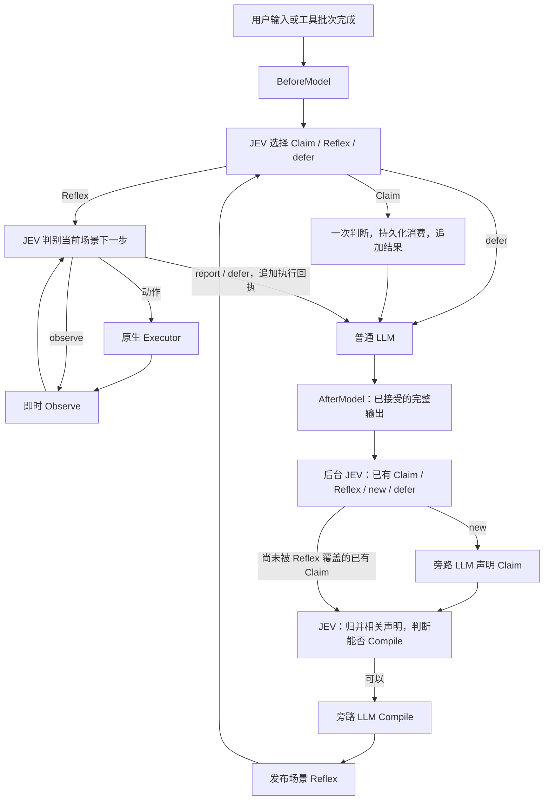

# JEV 可插拔旁路：Claim → Compile → Reflex

本文件是当前实现契约，替代原稿中的学习、训练、历史重放和激活流程。[研究稿](jev-harness-design-20260926.md) 保留为历史推导；其中样本一致率和启用门槛不适用于本实现。最新完整 ab5 证明连续短路和部分任务 LLM token 减少 80% 已生效，但全链路 token / 费用仍增加、原性能门槛未全部通过，详见 [验证记录](jev-validation-20260928.md)。

## 核心抽象

LLM 创造判断结构，JEV 在有限空间中判别。扩展只有两个领域类型：

```go
type Claim struct {
    When     string
    Question string
    Options  map[string]string
}
type Reflex struct {
    When    string
    Decide  string
    Sources []string
}
```

Claim 声明一次有限问题，例如“当前请求适合浏览器、HTTP，还是交回模型”。它没有 Chose、正确标签、示范动作或训练样本。声明只允许在来源任务及原用户约束仍有效时消费一次，包括 defer；完成任务之后生成的声明仅保留为编译材料。相同问题再次出现时，JEV 匹配已有声明，不重新创建或消费它。

Reflex 是可复用场景，例如“根据用户目标操作网页”。When 定义入口，Decide 定义选择和退出准则，Sources 引用工具提供的通用 `Observe` 能力。Reflex 不保存 URL、selector、动作序列或当前步骤。每一轮的实际选项由实时工具状态绑定。

Compile 是当前 LLM 的一次旁路生成调用。JEV 结合当前交互、相关 Claim 和已注册观察能力，判断能否形成具有明确退出边界的有限操作场景，再由 LLM 生成 Reflex。语义上足够完整的一个或多个 Claim 均可编译；数量不是启用门槛，未来尚未出现的具体参数由运行时绑定，不能因此要求场景覆盖一切操作。结构与能力引用合法后即发布。

上述三个 JSON 字段就是声明式 Reflex DSL，不引入可执行代码、页面脚本 DSL 或 `jev compile` 命令。后台 discovery 同时提供已有 Claim 和 Reflex，由 JEV 匹配能力级场景；页面 click/fill/select/wait 和控件变化不应产生新的页面级声明。自然语言中的通用性由模型判别，结构校验不冒充语义正确性证明。

`core/tool.Command.Observe` 是可选字段，签名为 `func(context.Context, []*aop.Message) (json.RawMessage, map[string]*aop.Content, error)`。注册表只增加对应的 `ObserveCommands() []string` 和 `Observe(ctx, name, messages)` 调用，复用已有 Command 生命周期和原生 AOP，不新增 DTO 或执行器。普通工具没有此字段也可执行；宿主只有原 CommandExecutor 而没有观察协议时，JEV 不安装加速 hooks。Reflex 持久化格式仍是 version 1，已有通用场景无需迁移。

## 架构与数据流



- `agent/provider/jev` 只实现原生协议、重试、用量；不认识 Claim/Reflex。429/529、响应头前 EOF 与响应体截断共用最多三次尝试、250/500 ms 退避及原总超时预算；重试只重新请求判别，失败尝试的缺失用量仍记为未知，不重放工具。
- JEV 标准 HTTP transport 为 provider 自己的副本，限定 HTTP/1.1，并同步 TLS ALPN、保留连接复用及原代理/TLS 设置，避免实测 HTTP/2 推理请求长时间无响应。不会修改全局 transport、其他模型请求或进程 GODEBUG；宿主注入的自定义 RoundTripper 继续保留。
- Agent 的 `BeforeModel` 返回追加的原生观察消息；`AfterModel` 在接受完整模型输出后、执行其工具调用前触发一次。二者都在请求重试之外，提供历史副本；最终回答也进入 AfterModel。
- `pkg/exts/jev` 独占声明、编译、持久化、候选判别及执行循环。AfterModel 只提交快照，网络工作在单个有界后台队列进行。旁路调用直接使用现有 Provider，不运行 Agent，所以不递归触发 hooks。
- 未匹配 Reflex 的新用户约束边界提交一次后台判别，使首次浏览器请求能产生能力选择 Claim；已匹配场景的入口不重复 discovery。普通 LLM 不等待声明或编译。Reflex 发布后只能在后续安全边界接管；每次 LLM 输出仍进入 AfterModel 判别。
- LLM 一次输出中的文本和多个 toolcall 分别作为判别问题，合并成一次 JEV 请求。无需将 LLM 参数与历史候选精确匹配。
- 新声明以及当前输出匹配到的未编译声明进入相关性归并和可编译性判断。匹配已有 Claim 不重新生成或消费该 Claim；已发布 Reflex 覆盖的声明直接复用。当前交互和观察能力名称进入判别，支持浏览器以外的有限操作。是否编译仍由 JEV 决定，没有强制通过、计数门槛或循环重试。
- 编译去重记录仅代表已经持久化的 Reflex。生成失败、无效结果和 null 不永久标记完成；后续普通交互可以再次触发判别。加载旧库时从已发布 Reflex 的支持声明重建完成记录，清除旧实现中仅尝试过生成的遗留标记。后台流程不执行用户工具。
- 轮前将入口问题、Reflex 的候选选择及未消费 Claim 的判别放在一个原生 JEV 请求中，共享状态。只执行入口选中的分支；未选中分支不授权任何动作。
- 已选 Reflex 在当前 BeforeModel 边界持续拥有控制权，后续请求仅判别其下一步；入口 When 不再被错误用作终点状态的持续条件。运行时保留 `observe`（刷新状态）、`report`（已有足够证据组织回答）、`defer`（缺参数/新策略/未知情况）三个出口，持久化 Reflex 仍只有三个字段。
- 每次场景请求同时判别共享的 `generation` 问题，以 ready / parameter / strategy / defer 区分已绑定、缺参数、缺策略和无法可靠判断；只有 ready 才接受场景动作。用户要求的填写即使 HTML 未标 required 也必须满足；不存在对应绑定时交给 LLM，不能选提交来跳过。尚未出现的条件要求不制造当前缺口。它与场景判断共享一次请求，不新增字段、配置参数或额外网络调用，不使用置信度阈值。
- 完整候选参数在共享 `state.candidates` 发送一次，场景选项只引用候选 ID；缺参数判别直接可见真正可执行的绑定，不依赖其他问题的选项上下文。来源和去重限制仍控制每个场景的可选集合。
- 工具只可选提供通用 `Observe(ctx, messages) (state, candidates, error)`；它只读取工具状态并生成当前原生候选，执行前自行做 stale/权限校验。JEV 不进入工具包，工具不认识 JEV。仍通过当前 Executor、CommandRegistry 和独立 Guardrail 执行；没有工具代理、第二个注册表、脚本解释器、provider 包装器或 kernel optimization 对象。

## 连续浏览器场景

Reflex 的闭环是“通用 Observe → JEV 选择 → 原生 Executor 执行 → 再 Observe”。没有会话时 Playwright 的 Observe 提供当前用户明确 URL 的 open 候选；已有会话时 Observe 读取所属页面，提供点击、下拉选项、滚动、等待、关闭及已知值填写。每次重新绑定当前节点，候选只能消费一次。其他工具可以用同一接口加入场景，不需要修改 JEV。

Playwright 返回 required/invalid/readonly/disabled、当前值、下拉选项和文档 mutation revision 等原始事实；disabled 控件保留事实但无执行候选。工具不按表单语义禁止提交，JEV 根据当前目标和事实判断前置条件，信息不足则交给 LLM。观察不隐式等待；即使 readyState 已完成，也提供显式 `wait-for --stable` 候选，只有选中时才调用工具的原稳定等待（500 ms）。等待绑定同一文档而允许其 DOM revision 改变，其他动作仍要求完整观察状态一致。这个等待不保证业务异步任务已完成，后续仍须重新观察。关闭候选沿用已有清理流程，返回关闭前页面证据；不能关闭同名重建会话。

观察候选使用普通调用 ID。Playwright 记录已发出的 DOM 动作 ID，并在工具自己的执行入口检查；没有调用 ID 前缀协议。新观察使上一候选集合失效，已消费、旧文档和关闭/重建会话的调用均拒绝，不能落回普通命令重放。ID 记录在 Command 生命周期内最多 65,536 项，达到上限后停止提供新候选并回退；不驱逐旧 ID 来换取不安全的重放。URL open 候选没有 DOM 绑定，仍按普通工具准入执行。

用户当前消息里明确引用的值（双引号、反引号或中文双引号，最多八项，每项最多 1000 字符）可成为非敏感输入框的填写候选。已成功执行的原生 fill 值仍可复用。远端页面文字和 JEV 回执不能引入新的输入值或授权。不能可靠确定字段和值时 defer，由 LLM 生成新参数。

每步依据最新状态判断下一动作，不按固定路径运行。已观察到结果时仍由 JEV 完成所需清理，再选择 report；需要新参数或策略才 defer。LLM 从一次追加回执中的真实结果报告，或只补齐具体缺口，不能因为调用来自 JEV 就再次读取。真实工具错误、拒绝、未知效果、新用户输入或预算耗尽结束当前执行。最终回答与漏洞确认仍由 LLM 完成，report 本身不是成功证据。

已确认未执行的 stale 候选重新 Observe 后由 JEV 选择，不能重放旧调用。扩展通过一个生命周期级 CommandCompleted 订阅关联在途 Invocation.CallID，恢复被 shell 丢失的单条命令 typed error；复合调用和执行器自身未知错误不得按此恢复。原失败完整记入审计及私有上下文；无效果且已恢复的 stale 不进入最终报告回执，未知失败仍标记 Attempted 并交回模型。

运行上限是 32 次判别、120 秒、64 个候选，包含 observe 与 stale 后重新判别。所选能力的相同物理状态下已派发动作从候选排除，相同状态的观察可由 JEV 在总预算内继续选择，避免过早将待完成效果交给模型；其他能力的时间戳或历史追加不会掩盖重复。它们是资源边界，不是历史学习门槛。支持的范围是文本/DOM 有限操作；任意视觉理解、复杂 iframe 或需要生成代码的操作仍交回普通模型。

curl 为已知 URL 提供 body/header/combined 读取，以及多个已知 URL 的对应批量候选。候选仍是普通 shell 原生调用，JEV 根据请求是否独立、是否需要全部读取来选择，不内置固定扫描路径；每条命令仍经过原准入。批量候选减少连续独立读取的 JEV 网络往返，没有新执行器或批处理 DTO。

任一观察源错误、无效或超限时，本轮交回模型，不丢弃该能力后从剩余候选中强行选择。工具返回空观察且无候选表示当前没有可观察状态，可以正常跳过。

## 生命周期、上下文和配置

- 工作区 `library.json` 保存带版本的 Claim/Reflex 定义、消费状态和编译去重记录。原 `reflex-*.json` 不自动迁移为新场景。动态时间、模型价格和系统提示哈希不再控制复用；每次用实际当前约束判别。
- 库上限为 32 个 Claim、16 个 Reflex；一次后台输出最多 32 个问题、一次分组最多 32 个 Claim，超限记录并回退，不丢弃竞争候选后强行执行。后台队列最多 64 项，每项最多两分钟；失败不阻断普通任务。
- `WaitIdle(ctx)` 只用于结算已提交后台工作的耗时和用量，不是运行期门槛。Close 取消后台请求和在途控制循环，卸载 hooks 并等待 worker 退出。
- 主对话已提交的 system/user/assistant/reasoning/tool 前缀不被改写。扩展不再通过 BeforeRun 修改系统提示；控制器说明仅随实际判断或执行回执追加，未接管且没有回执时不增加主模型提示。后台生成使用独立消息，不将编译材料注入主历史。
- 私有判别上下文采用有界文本投影，保留参数 JSON、调用/结果关联、错误/终止信息，去除 protobuf 包装和 base64 冗余。全部 system/真实 user 约束保留；旧证据省略会显式标记。它不改变主对话，也不假设 JEV 支持服务端增量状态。
- 媒体约束无法保留、文本约束超限或安装了后置上下文重写回调时，扩展回退。Agent 原有压缩是独立行为；缓存是否真正命中以供应商用量为准。
- 主 LLM 的并行 toolcall 完成后才进入下一 BeforeModel；后台发布不会抢占它们。

```yaml
extensions:
  jev:
    mode: auto           # 默认 off；不存在 learn 模式
    model: jev-1.13.0
    timeout: 10s
    # api_key: 使用 TYPESAFE_API_KEY
    # directory: 默认工作区 .cyber/jev
  guardrail:
    provider: none       # 或 jev，与加速独立
```

旧的 enabled/level/on_error/criteria 仅保留给 aiscan 的风险配置兼容。配置 key 不自动开启加速。`jev status` 显示当前库；没有强制激活、学习或导入旧规则命令。

`decisions.jsonl` 记录发现、归并、Claim/Compile 模型用量、运行判别和失败；`execution-<task>.jsonl` 保存完整调用、工具结果及最终观察。所有旁路成本都应计入性能评估。

## 验证

确定性集成测试从空库覆盖后台声明、Compile、下一边界连续执行、一次性消费、跨任务隔离、持久化、重试、流式完整输出、多个 toolcall、Guardrail、取消、过期候选和只追加历史。执行器单元测试可以预置场景，但不作为自动生成证明。

实际 Chromium 集成测试从普通浏览器任务开始，自动编译后复用到不同标签和结构的页面。设置 `JEV_BROWSER_LIVE=1` 及两组凭据后使用真实 JEV/LLM；`JEV_BROWSER_REPORT` 保存库、实际动作、正确性、前缀变化及全部后台用量。

`TestLiveAutomaticReflexAB` 比较 off/auto：一个普通发现任务后，默认至少 20 对任务；轮换顺序，核对最终页面、服务端访问记录和答案。没有预置规则、特殊任务提示或激活操作。`JEV_BENCH_PAIRS` 可缩小为冒烟测试，但不足 20 对时报告明确不能建立性能验收。

任务失败或没有实际接管会记录并拒绝验收，同时继续收集后续配对。后台用量在独立于前台任务 deadline 的有限窗口内结算；结算失败保留当前行并标记费用未知，停止后续归因。`JEV_BENCH_RESUME=1` 可从指定报告及原持久化库继续尚未记录的配对，要求模型、价格和样本数一致；中断记录不能算零成本。该开关只属于测试，不是扩展运行期机制。HTTP 测试要求普通报告以明确的 `Verdict: ...` 行结束，避免解释中提及另一个结论被误判。

费用由测试环境 `JEV_BENCH_PRICES` 提供，仅用于核算，不影响运行。统计主 LLM、旁路声明和编译、全部 JEV 请求与失败请求；reasoning 是 output 子集。没有实际 Reflex 动作、正确性失败、用量缺失或代理计价未知时，不宣称生产节省。

验收目标保持：浏览器复用阶段主 LLM 调用下降 50%、全部 LLM output 下降 30%、有完整计量时 reasoning 下降 30%、中位耗时下降 20%；aiscan 中位耗时及总费用下降 15%；p95 退化不超过 10%。首次发现成本单独报告，不能从总成本中排除。

额外报告 80% 目标：分别按全部 LLM input+output（包含后台 Claim/Compile）和 LLM+JEV 全供应商 token，统计减少至少 80% 且耗时下降的正确配对任务数；output 和 reasoning 子项独立列出。同步报告参考费用，不能把模型调用减少或 LLM token 节省等同于全链路节省。

```powershell
go test ./agent ./agent/provider ./agent/provider/jev ./core/tool ./pkg/exts/jev ./pkg/exts/guardrail ./tools/curl ./tools/toolargs ./pkg/harness -count=1
go test -tags full ./tools/playwright ./pkg/exts/browser ./pkg/exts/jev -count=1
go test -tags 'full sqlite' ./cmd/aiscan -count=1
go test -race ./agent/provider/jev ./pkg/exts/jev ./core/tool -count=1
```

实测结果见 [验证记录](jev-validation-20260928.md)。历史 seeded/学习版本与 Observe 基线的数据不能视为本修订的验收。[JEV 主导执行设计](jev-controller-design-20260928.md) 记录本次控制权、恢复和交接的实现边界。
