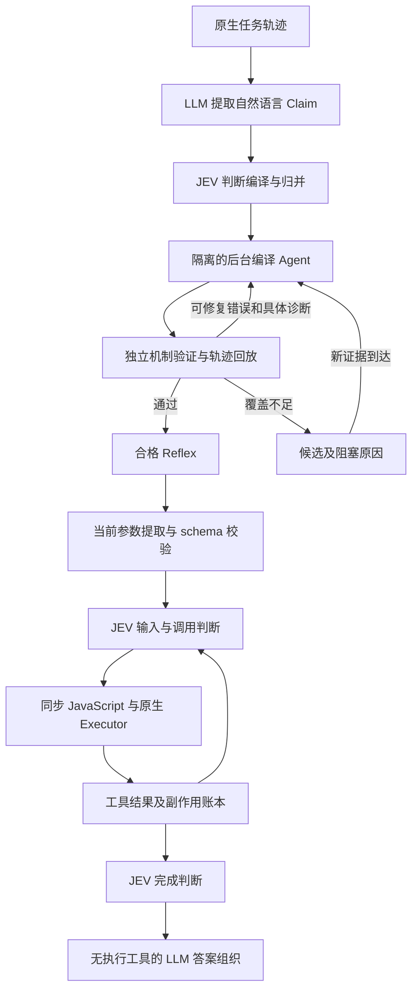

# JEV / Reflex 补齐实现与验证（2026-10-05）

本次已清理生产代码的业务验证套件耦合，补齐原生工具契约、持续编译修复、独立验证、冻结运行约束及编译／运行 UI。真实实验已自主生成浏览器 Reflex，并在复用时通过真实 JEV 执行，普通 LLM 执行推理调用为零。**这证明浏览器场景具备替代可行性；此前四轮失败不能再代表当前实现，但也不能据此宣称所有任务都可稳定替代或计算回本。**

这里的“替代”只指执行过程中的规划、分支选择与结果验收。LLM 仍可用于后台编译、当前参数提取和最终答案组织。参数提取与答案组织的调用及费用都必须计入运行用量。

## 当前控制流与解耦



生产路径不再依赖 `VerificationSuite`、`CheckInput`、`CheckCall`、`CheckReport` 或业务套件注册。旧业务验证接口仅存在于 `_test.go`，作为独立实验 oracle 保留，不能影响实际产品执行。旧库中的 `suite` 字段只用于解码兼容，带此字段的旧产物不能直接接管执行。

工具维护者通过 [NativeContract](../core/tool/native_contract.go) 声明版本、读写分类、原生操作结果与同一操作身份的查询方式。契约描述工具协议，不判断“订单已完成”之类的业务结论。注册按批次原子提交，生命周期由 Extension Scope 管理；加载失败和卸载会撤回能力，旧 handle 不能删除后来注册的能力。浏览器扩展随原生命令一起贡献契约，普通宿主无需再注册业务验证套件。

[编译 Agent](../exts/jev/compiler_agent.go) 使用 `validate_reflex` 和 `inspect_evidence`，不能调用前台用户工具。同一个 Agent 保留修复历史，持续读取真实轨迹、提交代码并根据诊断修改；已删除 3 个草稿、3 次工具提交、8 轮交互和隐式 3 分钟的提前终止。工具提交与最终文本现在经过相同的完整验收：机制、回放和独立 JEV 语义判断全部通过才结束。取消或供应商错误保留未合格候选，真正缺少证据／能力时等待新证据，不把它伪装成代码错误。

本次找到的本质问题是**生成、验收和执行没有共享一致的证据与完成定义，修复循环又被提前截断**。工具反馈只覆盖机制，最终文本在外层遇到覆盖缺口便结束；固定次数进一步截断 Agent。语义拒绝有时只返回 progress，丢掉具体失败边界。现在工具与最终文本使用同一验收，所有可修复拒绝回到同一个 Agent，并保留边界、下一调用与实际结果。

真实实验还暴露了两个闭环缺口。第一，编译器能看到 decoded_argv，运行时 history 却没有；JEV 的调用判断也继续使用入口上下文，看不到刚打开的会话及新结果。现在编译／运行统一规范化 history，每次实际执行后更新 JEV 上下文，后台新证据也随修复反馈送入编译器。第二，“所有调用回放完毕”曾把最终 defer 算作完成；现在入口必须产出 report，新的 `entry_report` 资格检查使旧证明失效并保留为候选。`completion_missing` 明确说明如何处理 execute 返回值；history 是函数入口快照，不能等待它在当前调用中自动增长。

长时间修复曾因编译 Agent 未配置上下文压缩 prompt 耗尽窗口。现在编译器具有自己的修复工作记忆摘要，保留最近草稿、诊断、失败尝试与精确参数，真实证据仍可通过 inspect_evidence 重读。上下文窗口沿用宿主设置；压缩请求及其费用计入编译。最终文本封装也修正了不支持的场景字段和缺省参数 schema 被序列化为 null 的问题。

[编译 skill](../exts/jev/skills/reflex-compiler/SKILL.md) 自动嵌入运行时 prompt，指导参数编码、入口前提、效果身份、轮询和证据验收。[语义诊断](../exts/jev/compiler_diagnostic.go) 提供 code、stage、status、action、边界、调用位置、expected／actual 和回放进度；UI 同时展示原始产物与可操作的修复信息。inspect_evidence 返回真实 joined results 和 decoded argv，不生成示例结果。

读取分类和结果验收使用独立语义问题，结果字段错误不再误报为 read 标志错误。参数提取提示显式提供 parameters_schema 并要求实际属性值，避免模型回显 schema 元数据。证据路径支持字符串对象键和非负整数数组下标，拒绝小数、越界及标量穿透。

## 资格验证与运行约束

[资格验证](../exts/jev/qualification.go) 检查语法、参数 schema、步骤 manifest、原生契约、有限分支和已记录轨迹。发布需要从初始边界完成至少一条完整回放；缺少已记录结果、跳过操作、提前结束、调用不匹配都不能冒充成功。只对不含展开或复合语句的单条字面量 shell 命令比较解码后的 argv，同时保留其他工具参数的严格比较。目标、选项或参数变化仍会拒绝。

资格记录绑定源码 hash、轨迹 hash 和契约版本，并显式保留未覆盖分支。**机制验证通过不等于所有业务、故障路径或 Playwright 场景都正确。** 当前回放只证明代码能解释所记录的轨迹；运行时仍需要 JEV 根据当前请求、约束和实际证据判断输入、调用授权及完成情况。

Reflex 继续使用同步 JavaScript。宿主执行参数检查、原生读写分类、次数边界、证据引用解析与副作用身份约束。副作用身份由任务、步骤和 occurrence 构成；同一身份参数改变会拒绝，未知结果阻止新的写操作，只有原生契约确认同一操作身份才可解除未知状态。相同参数的两次有意操作必须使用不同 occurrence，不能被去重为一次。

JEV 超时、拒绝、参数缺失、能力不支持或证据不足会交还主模型；这类交接不是替代成功。严格替代实验禁止恢复普通执行推理，因此交接会使该任务无法通过替代验收。完成交接后的答案组织由 Agent 通用请求策略清空执行工具，流式调用、重试及供应商主动返回工具调用也受到约束。

恢复目前限于存活任务中的账本和工具操作记录。没有实现进程重启后的持久恢复，也没有跨进程 exactly-once 保证。

配置默认 `jev.mode=off`；启用值为 `auto`。`jev.learning=auto` 学习 Claim 并编译，`frozen` 只复用已有合格 Reflex，不能重新学习或编译。

`jev.compilation_timeout=0` 是默认值，不设总编译时间限制；正 duration（例如 10m）由宿主显式选择。取消、原生能力缺失、真实证据不足和模型服务不可用仍会结束当前工作。Agent 使用现有上下文压缩机制；这不保证每个模型或任意任务一定能收敛。

## 浏览器与 UI 范围

浏览器提供结构化 `snapshot --json`、当前页面及原生状态读取、已有会话操作、开放 Shadow DOM 寻址和 `operation-status` 操作记录查询。任意 `evaluate`、拦截器修改、文件写入及未声明能力不能因模型填写 `read:true` 而获得准入。原生操作返回只确认调用结果；页面业务完成仍需要新证据。

原生契约已按实际命令名对齐，包括 `inner-text`、`select-option`、等待命令及导航别名。`content`、`network` 只有实际已有会话变体属于读取；`goto` 与命令真实派发一致，已有会话变体读取文本，URL 变体属于导航副作用。裸域名不能伪装为只读。第 5 轮之后的真实实验使用这些分类及更详细的回放诊断。

前端分别展示自然语言 Claim、候选与 blocker、合格 Reflex、机制验证范围及缺口、编译 Agent 轮次、提交代码和验证诊断。运行时间线展示 JEV 判断、原生调用和结果、任务内副作用状态、计算结果及完整交接原因。

编译用量与运行用量独立汇总，按事件／请求身份去重，编译父请求与子轮次不会重复累计。没有用量的模型调用显示缺失；本地验证没有模型用量并不算缺失。没有确认费率时显示费用未确认。

## 本地验证

以下检查通过，付费 opt-in 测试不混入本地回归结果：

| 验证 | 结果与范围 |
| --- | --- |
| 机制实验矩阵 | 80 个案例；含正常、503、工具返回错误、缺少查询能力与参数编码；业务 oracle 仅在测试中 |
| Agent / Executor 矩阵 | 120 个条件；含正常、503、工具错误、缺少查询、Guardrail 拒绝、缺少输入 |
| Go 回归 | JEV、工具、Agent、Guardrail、Web 服务、终端、Playwright、浏览器扩展通过 |
| Race | 全部 `TestReflexV2` 通过；真实 profile 流式集成亦通过 Race |
| 原生浏览器 | 真实 Chromium 结构化快照、操作记录和最新契约分类测试通过 |
| 前端 | TypeScript / Vite 构建通过；JEV UI 57 项通过、0 跳过，包含结构化修复、完成缺失和原生轨迹等待诊断 |
| 持续修复 | 同一 Agent 连续 12 次调用不匹配后修复成功；工具与最终文本路径各 14 轮模型请求。语义拒绝、格式错误、取消保留候选、缺少证据等待均有独立测试 |
| 上下文与完成语义 | 修复历史压缩后持续到第 21 个草稿并合格；全部调用回放后 defer 仍被拒绝，处理新结果并 report 后通过；旧证明不得接管 |

[Profile 集成测试](../cmd/aiscan/jev_profile_flow_test.go) 使用实际 aiscan 默认浏览器契约、namespace mux、bash 与 session runtime，并验证协议事件序列化回放。它从空库经过训练、编译、发布，再在第三个任务复用；复用只调用一次无工具答案组织，没有普通 LLM 执行推理。[Web 服务测试](../pkg/web/service/jev_test.go) 单独验证 SQLite 持久回放与背压下的后台发布。推断模型及 JEV 响应使用模拟实现，因此这些测试证明调用链、流式约束和事件回放接通，不能证明付费模型自主编译的准确率。

UI 测试同时回放 [profile 事件](../web/frontend/e2e/fixtures/jev-history/profile-events.json) 和第 4 轮真实失败的编译事件。Profile 夹具单独提供任务摘要，最终回答每个任务显示一次。实际付费失败不会被替换为模拟成功。截图及 HTML 报告位于 `web/frontend/test-results/jev` 和 `web/frontend/playwright-report/jev`。

## 真实模型实验

LLM 使用 DeepSeek 官方端点 `https://api.deepseek.com` 的 `deepseek-flash`，JEV 使用 `jev-1.13.0`。冷启动实验独立空库，不预置或人工编辑 Reflex 源码；暖启动实验明确记录 library_origin，原样复用自主生成的库。三类任务分别是浏览器 UI 查询、异步结果未知后的同操作轮询、相同参数的有意重复副作用。每类最多 3 个冷启动训练任务；每个编译 Agent 内部持续修复，实验设置显式 10 分钟编译期限，生产默认没有这一期限。

计划对比普通 LLM、同一冻结 Reflex + LLM 有限判断、同一冻结 Reflex + 真实 JEV。先运行 5 组配对任务，仅所有分组都通过才扩展到 30 组。独立服务器 oracle 检查实际目标、操作次数及当前 receipt；不能仅用自然语言答案自评。

| 实验 | 冷启动成功（浏览器／异步／重复） | 普通 LLM 成功（每类 5 次） | 编译模型请求 | 合格 Reflex |
| --- | --- | --- | ---: | ---: |
| [第 1 轮](evidence/jev-reflex-20261005/reflex-replacement-live-20261005/report.json) | 3/3 · 1/3 · 1/3 | 3/5 · 3/5 · 3/5 | 0 | 0 |
| [第 2 轮](evidence/jev-reflex-20261005/reflex-replacement-live-20261005-r2/report.json) | 3/3 · 0/3 · 2/3 | 5/5 · 2/5 · 3/5 | 8 | 0 |
| [第 3 轮](evidence/jev-reflex-20261005/reflex-replacement-live-20261005-r3/report.json) | 2/3 · 3/3 · 3/3 | 4/5 · 5/5 · 5/5 | 12 | 0 |
| [第 4 轮](evidence/jev-reflex-20261005/reflex-replacement-live-20261005-r4/report.json) | 3/3 · 3/3 · 3/3 | 3/5 · 5/5 · 5/5 | 13 | 0 |

每轮有 30 条被资格门槛阻塞的 Reflex 分组记录（3 类 × 2 个 Reflex 分组 × 5 次）。它们没有实际执行，不能记成运行失败率，更不能记成零成本成功。四轮均未扩展到 30 组，也没有实际完成冻结 Reflex 的配对运行对比。

第 1 轮 JEV 始终推迟编译。修正能力描述及提示后，第 2 轮开始调用编译 Agent。第 3 轮补正工具／命令区别与单调用约束；第 4 轮补充精确 `execute` 格式、step 与 contract 的区别和候选保留。第 4 轮三类场景各保存一个候选，但均未通过资格验证。

剩余失败包含缺少 step／occurrence、argv 或示例字符串不匹配、未完整回放轮询轨迹、用错示例结果。异步候选读取一次后提前 defer，重复操作候选只返回 actor，未完成操作次数与 receipt 的要求。资格门槛正确保留这些失败，但真实自主编译能力尚未达到替代要求。

以下续测分别保留，不能合并成一次成功实验：

| 实验 | 类型与实际结果 | 暴露的问题／解释 |
| --- | --- | --- |
| [第 5 轮](evidence/jev-reflex-20261005/reflex-replacement-live-20261005-r5/report.json) | 三类冷启动，393 个编译请求，0 合格 | 持续交互已接通；证据引用不能遍历数组、反馈不够具体，异步修复耗尽上下文 |
| [第 6 轮](evidence/jev-reflex-20261005/reflex-replacement-live-20261005-r6-browser/report.json) | 浏览器冷启动，61 个编译请求，1 个自主合格产物 | 冻结后两组均 0/5；参数提取回显 schema 元数据 |
| [第 7 轮](evidence/jev-reflex-20261005/reflex-replacement-live-20261005-r7/report.json) | 三类冷启动，208 个编译请求，0 合格 | 当时二进制尚未包含后续运行时证据与参数修复 |
| [第 8 轮](evidence/jev-reflex-20261005/reflex-replacement-live-20261005-r8-browser-runtime/report.json) | 浏览器暖启动，真实 JEV 0/5 | 参数正确，但调用判断仍使用入口上下文，无法看到新会话 |
| [第 9 轮](evidence/jev-reflex-20261005/reflex-replacement-live-20261005-r9-browser-runtime/report.json) | 浏览器暖启动，真实 JEV 3/5 | 新会话可见；2 次点击后的确认读取被误拒绝 |
| [第 10 轮](evidence/jev-reflex-20261005/reflex-replacement-live-20261005-r10-browser-runtime/report.json) | 浏览器暖启动，普通 LLM 5/5，真实 JEV 5/5 | JEV 执行推理 LLM 调用为零；有限 LLM 对照因返回协议错误仍 0/5 |
| [第 11 轮](evidence/jev-reflex-20261005/reflex-replacement-live-20261005-r11-browser-runtime/report.json) | 浏览器暖启动，扩展到 30 组；普通 LLM 25/30、有限 LLM 16/30、真实 JEV 27/30 | 前 5 组全部通过后扩展；第 27—29 组都遇到 DeepSeek 402。余额可用期间真实 JEV 为 27/27，有限 LLM 为 16/27，普通 LLM 为 25/27 |
| [第 12 轮](evidence/jev-reflex-20261005/reflex-replacement-live-20261005-r12-async/report.json) | 异步冷启动，59 个编译请求，0 合格 | 具体分项可通过但整体 progress 拒绝未收敛；编译 Agent 缺失压缩 prompt，最终窗口耗尽 |
| [第 13 轮](evidence/jev-reflex-20261005/reflex-replacement-live-20261005-r13-repeat/report.json) | 重复操作冷启动，4 个编译请求，1 个旧规则合格产物；冻结两组均 0/5 | 同步函数完成两次 append 和 summary，却再扫描入口 history 并 defer；旧验收误把调用回放完成算作任务完成 |
| [第 14 轮](evidence/jev-reflex-20261005/reflex-replacement-live-20261005-r14-repeat/report.json)、[第 15 轮](evidence/jev-reflex-20261005/reflex-replacement-live-20261005-r15-async/report.json) | 使用 entry_report 与压缩修复重新冷启动；均未完成合格验收 | 训练模型仍生成复合 shell 调用；随后 DeepSeek 返回 402 Insufficient Balance，最新修复未完成付费准确率验证 |

第 8—11 轮使用第 6 轮自主产物原样复制，未编辑源码／证明。第 11 轮全部 Reflex 运行组的普通 LLM 执行请求均为零。第 27—29 组仍需 LLM 参数提取，余额不足后无法执行，因而**完整实验记录是 27/30，不能改写为 30/30**。27/27 只描述服务可用期间的已完成任务。该实测早于最后新增的 entry_report 检查；当前旧库会保留为候选，需重新资格验证后才能接管，不能修改旧证明来继续试验。

第 14／15 轮中的复合 shell 返回不能被安全拆成独立调用证据。现在 `recorded_capability_unavailable` 会等待受支持的真实轨迹／原生契约，保留精确原调用；不能通过修改源码、循环重试或伪造 call ID 修复证据本身。付费 harness 也在凭据／余额不可用的 401、402、403 后停止并保存已有请求，避免把供应商阻塞当作模型准确率结果。当前无余额继续实测，异步与重复场景的稳定替代仍未证实。

## 费用记录与判定

费用根据每轮返回用量和该轮保存的公开费率快照估算，**不是账单**。采用 DeepSeek 当日节假日优惠：输入未命中缓存 $0.15/M、缓存读取 $0.003/M、输出 $0.60/M；JEV 输入 $0.042/M、输出免费。来源为 [DeepSeek 定价](https://api-docs.deepseek.com/quick_start/pricing) 及 [TypeSafe JEV 介绍](https://typesafe.ai/blog/introducing-system-one-models-and-jev)，费率随每轮报告保留，原始网页快照位于本地 `output/deepseek-pricing.html`。将来复测需使用测试时实际适用费率。

| 实验 | 全部实际尝试估算费用（USD） | 明细 |
| --- | ---: | --- |
| 第 1 轮 | 0.091388940 | [编译／运行分析](evidence/jev-reflex-20261005/reflex-replacement-live-20261005/cost-analysis.md) |
| 第 2 轮 | 0.058776702 | [编译／运行分析](evidence/jev-reflex-20261005/reflex-replacement-live-20261005-r2/cost-analysis.md) |
| 第 3 轮 | 0.075865956 | [编译／运行分析](evidence/jev-reflex-20261005/reflex-replacement-live-20261005-r3/cost-analysis.md) |
| 第 4 轮 | 0.059855643 | [编译／运行分析](evidence/jev-reflex-20261005/reflex-replacement-live-20261005-r4/cost-analysis.md) |
| 第 5 轮 | 0.446190855 | [编译／运行分析](evidence/jev-reflex-20261005/reflex-replacement-live-20261005-r5/cost-analysis.md) |
| 第 6 轮 | 0.107492898 | [编译／运行分析](evidence/jev-reflex-20261005/reflex-replacement-live-20261005-r6-browser/cost-analysis.md) |
| 第 7 轮 | 0.317590389 | [编译／运行分析](evidence/jev-reflex-20261005/reflex-replacement-live-20261005-r7/cost-analysis.md) |
| 第 11 轮 | 已知 0.265944666；9 次请求用量缺失 | [暖启动运行分析](evidence/jev-reflex-20261005/reflex-replacement-live-20261005-r11-browser-runtime/cost-analysis.md) |

第 5 轮后沿用第 4 轮费率快照，未独立重核当前适用价格或账单；缺少用量的供应商失败请求显式列为缺失。第 8—11 轮只统计本轮暖启动运行，继承的编译成本未计入，因此不计算编译回本。各轮 cost-analysis 保留全部尝试，含供应商受阻计数，不能只选择成功任务估算节省。

Claim／编译 LLM 与后台 JEV 计入编译；执行、参数提取、答案组织、有限 LLM 判断与前台 JEV 计入运行。冷启动期间的普通执行费用另列，不隐藏在编译内。LLM 有限判断代理按 LLM 请求收费，不能再作为 JEV 重复收费。各轮请求总数与逐尝试记录之和一致，第 1—10、12—13 轮返回用量完整；第 11、14、15 轮保留供应商失败请求的用量缺失。

单任务费用以全部实际尝试成本除以成功执行任务数，包含失败开销；被阻塞的 Reflex 分组显示空值。仅配对分组全部实际通过、用量完整且有正运行节省时计算回本。本次不满足这些前提。

[机器可读验证记录](evidence/jev-reflex-20261005/jev-reflex-final-validation.json) 保留本地检查与逐轮实测汇总。原始执行日志继续保存在本地 output 目录；仓库只保存报告和复现 UI 所需夹具。

## 复现与后续验收

在仓库根目录运行本地检查：

```powershell
go test -tags 'full sqlite' ./exts/jev ./core/tool/... ./agent/... ./exts/guardrail ./pkg/web/service ./tools/terminal ./tools/playwright ./exts/browser -count=1 -timeout 300s
go test -race -tags 'full sqlite' ./exts/jev -run '^TestReflexV2' -count=1 -timeout 180s
$env:JEV_PROFILE_FLOW_EVENTS=Join-Path $PWD 'output/jev-profile-flow-events.json'
go test -race -tags 'full sqlite' ./cmd/aiscan -run '^TestJEVProfileStreamingCompilationRuntimeAndProtocolEvents$' -count=1 -timeout 180s
```

在 `web/frontend` 下运行。UI 测试默认使用仓库中的历史事件夹具，可通过环境变量覆盖为新实验日志：

```powershell
npm run build
npm run test:jev
```

付费实验入口是 [replacement_live_test.go](../exts/jev/replacement_live_test.go) 的 `TestLiveReflexExecutionReplacement`。在测试进程环境注入 `CYBER_API_KEY`、`TYPESAFE_API_KEY`；配置 `CYBER_MODEL`、`CYBER_BASE_URL`、`JEV_REPLACEMENT_LIVE=1`、新的 `JEV_REPLACEMENT_REPORT` 目录，以及 `JEV_BENCH_PRICES`／`JEV_BENCH_PRICE_SOURCE`。不要把凭据写入仓库。执行命令：

```powershell
go test -tags 'full sqlite' ./exts/jev -run '^TestLiveReflexExecutionReplacement$' -count=1 -timeout 45m
python exts/jev/testdata/replacement_report.py output/reflex-replacement-live-20261005 output/reflex-replacement-live-20261005-r2 output/reflex-replacement-live-20261005-r3 output/reflex-replacement-live-20261005-r4
```

已完成本次发现的修复闭环、证据 ABI、运行时新鲜上下文、结果路径、完成定义及上下文压缩补齐。付费模型余额恢复后的下一步是在新的空库目录分别执行三类实验；最新版本不得复用缺少 entry_report 的旧证明。可设置 `JEV_REPLACEMENT_FAMILY=browser|async|repeat` 逐类诊断，`JEV_REPLACEMENT_REPORT` 使用绝对路径。只有库符合当前资格规则时，才使用 `JEV_REPLACEMENT_LIBRARY_FROM` 做明确的暖启动运行验证。

不得降低完整回放门槛或植入源码来获得成功率。最终稳定替代验收需要三类配对组实际通过，冻结产物一致、普通 LLM 执行调用为零、独立 oracle 通过，并单独计入参数提取、答案组织、编译与失败成本。当前浏览器运行可行性已有真实证据，其余范围及最新资格版本的自主收敛仍需续测。
